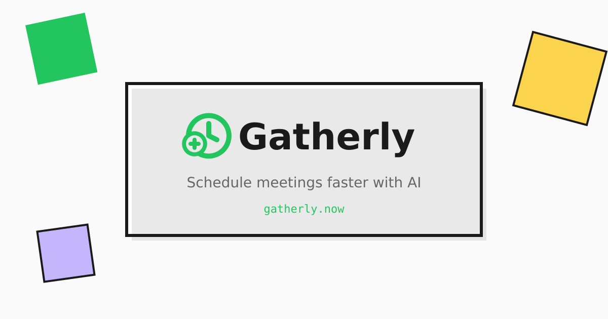

<p align="center">
  
</p>

<h1 align="center">Gatherly</h1>

<p align="center">
  <strong>Schedule meetings in seconds, not minutes.</strong>
</p>

<p align="center">
  <a href="https://gatherly.now">Live Demo</a> ·
  <a href="#how-gatherly-works">Features</a> ·
  <a href="#local-development">Get Started</a>
</p>

<p align="center">
  
  
  
</p>

<p align="center">
  
</p>

---

## The Problem We Solve

Scheduling is broken. Every week, millions of hours are wasted on the same tedious dance: "When works for you?" followed by endless email chains, When2Meet polls that nobody fills out, and calendar tabs open side-by-side trying to find a sliver of overlapping free time.

This is administrative work that adds zero value to your life. You don't enjoy scheduling a study session for your group project. You enjoy the study session itself. You don't enjoy coordinating a coffee catch-up with an old friend. You enjoy the conversation.

We built Gatherly because we believe AI should handle the tedious coordination so humans can focus on the face time that actually matters.

---

## Our Thesis

The scheduling problem has existed for decades, and existing tools like Calendly, Doodle, and When2Meet have only partially solved it. They digitized the process but kept the friction. You still click through forms. You still manually compare calendars. You still send follow-up reminders.

We asked a simple question: what if you could just tell your calendar what you want, and it figures out the rest?

Our thesis is that natural language AI can collapse the entire scheduling workflow into a single sentence. Type "dinner with the team next Friday" and the system should understand who, what, when, and where. It should check availability, suggest times, send invites, and confirm the event. All without forms, all without clicking through date pickers.

We chose to start by replacing When2Meet because thats where the pain is most acute. Group scheduling is exponentially harder than one-on-one meetings. Coordinating five peoples calendars manually is a nightmare. But for AI, its just a constraint satisfaction problem.

Rather than building from scratch, we integrated with the tools people already use and trust. Google Calendar holds your data securely. Gmail delivers your invitations. We add the intelligence layer on top, respecting the infrastructure you already have rather than asking you to migrate to yet another platform.

---

## How Gatherly Works

### The Chat Interface

At the center of Gatherly is a chat bar. You type what you want to schedule in plain English. The AI parses your request using OpenAI GPT-4o-mini and extracts the key details: event title, participants, proposed times, duration, and location.

For example, typing "lunch with Sarah and Mike next Tuesday around noon for an hour at Shake Shack" creates an event with all those details pre-filled. The AI understands context. It knows "next Tuesday" means a specific date. It knows "around noon" means flexible timing. It knows "Shake Shack" is a location, not a person.

If you leave details out, Gatherly asks clarifying questions or makes reasonable defaults. An unspecified duration defaults to 60 minutes. An unspecified location shows as TBD until you fill it in.

### Continuous Editing Through Conversation

The chat interface is not a one-shot interaction. After your initial prompt creates an event, you can keep prompting to refine it. Say "actually make it 2pm instead" and the pending event updates. Say "add Jessica to the invite" and she gets added to the participant list. Say "change the location to Blue Bottle Coffee" and the location updates.

While you edit, the pending event appears on your calendar as a green overlay. You can see in real-time whether your proposed times conflict with existing commitments. No more switching between tabs to cross-reference. The conflict detection happens visually, right where your events live.

This conversational editing continues until you hit send. The AI maintains context across multiple prompts, so you can iterate naturally without starting over.

### Voice Dictation

For hands-free scheduling, Gatherly supports voice dictation. Click the microphone icon and speak your scheduling request. The browser's speech recognition transcribes your words into the chat input, and the AI processes it the same way it handles typed text. Schedule a meeting while walking to your next class. Add a reminder while cooking dinner. Voice input makes Gatherly accessible when your hands are occupied.

### The Calendar View

Your Google Calendar syncs in real-time through OAuth. Events from all your calendars appear in a weekly view, color-coded by calendar source. When you create a Gatherly event, the proposed time slots appear as green overlays on the calendar so you can instantly see conflicts.

The calendar is fully interactive. Click any time slot to manually add an option. Drag to adjust duration. Toggle individual calendars on or off to focus on specific commitments.

We handle Google Calendar sync with care. On initial load, Gatherly fetches your events for a rolling window around the current date. The OAuth token refreshes automatically in the background, so your session stays alive without re-authentication. Events you create through Gatherly sync back to Google Calendar immediately upon confirmation, appearing in your native calendar app within seconds.

### Persistence and State Management

Gatherly persists your preferences and recent activity across sessions. Your calendar toggle selections save to local storage, so if you prefer to hide your work calendar while scheduling personal events, that preference sticks. Your recent contacts save locally too, making it faster to add people you schedule with frequently.

Session state uses a combination of React state and Supabase real-time subscriptions. If you close the tab mid-edit and reopen it, pending events in the database restore automatically. Notifications you have not read remain unread until you explicitly dismiss them.

### The People Section

Gatherly tracks the people you schedule with most often. The recent contacts list appears when you start typing a participant name or email. Select from suggestions rather than typing full email addresses every time.

The contacts pull from two sources: your Google Contacts via the People API, and your Gatherly scheduling history. If you scheduled coffee with someone last month, they appear near the top of suggestions when you type their first letter.

We never show your own email in the recent contacts list. That would be redundant. The filter runs automatically.

### The Location API

Gatherly integrates with the Google Places API for location autocomplete. Start typing an address or venue name and suggestions appear instantly. Select one and the full address, plus a link to Google Maps, gets attached to your event. Invitees see the location in their invitation email with a clickable map link.

This matters because location is often the forgotten detail. How many times have you shown up to a meeting only to realize you don't know which conference room, which coffee shop, or which building entrance? Gatherly makes location a first-class citizen in the scheduling flow.

### The Invite System

Once you finalize your event details, Gatherly sends email invitations through Resend. Each invitee receives a beautifully formatted email with the event details, proposed time options, and a unique response link.

The response page shows each time option as a card. Invitees select which times work for them. Their responses are recorded instantly and the organizer receives a real-time notification. No account creation required for invitees. No app download. Just click the link and respond.

When all invitees have responded, the organizer sees a summary of availability and can confirm the final time with one click. The confirmed event automatically syncs to Google Calendar for everyone involved.

### Reminders

Life gets busy and people forget to respond to invites. Gatherly lets organizers send reminder nudges to participants who have not yet submitted their availability. One click sends a friendly reminder email with the original invite link. The reminder system is smart enough to skip participants who already responded.

You can send reminders from the event detail page or directly from the calendar view. The button appears on pending Gatherly events alongside options to view details or cancel.

### Google Meet Integration

For virtual meetings, Gatherly can automatically generate a Google Meet link. Toggle the option when creating an event and the meeting link gets embedded in the calendar invite. Attendees click to join without any additional setup.

### Notifications and Daily Summary

Gatherly includes a notification system powered by Supabase Realtime. When an invitee responds to your event, you see a notification instantly. When an event is confirmed, all participants get notified. When someone cancels, everyone knows immediately.

Beyond transactional notifications, Gatherly generates an AI-powered daily summary. Each morning, you see a briefing of whats on your calendar today, whats coming up this week, and suggested events based on your patterns. The AI might notice you havent scheduled a one-on-one with a teammate in a while, or that you have a free afternoon perfect for deep work. Suggested events appear as quick-add cards. Click one and it populates the create event form with sensible defaults.

You can dismiss individual notifications or clear all of them at once. The notification dropdown appears above everything else in the interface, so it never gets lost behind modals or overlays.

### Event Management

Every Gatherly event has a dedicated page where organizers can edit details, remind participants who havent responded, or cancel the event entirely. Cancellation sends a notification email to all invitees and removes the event from Google Calendar.

Organizers can edit participant lists after creation. Add someone you forgot. Remove someone whose schedule changed. The system handles the invite logistics automatically. Removed participants receive a cancellation notice. Added participants receive a fresh invite.

You can also edit the proposed time options. Change a date that no longer works. Adjust the duration. Add a third option if the first two arent getting responses. All changes propagate to invitees.

---

## Design and User Experience

### Dark Mode

Gatherly supports a full dark mode for users who prefer reduced eye strain or simply like the aesthetic. Toggle it from the header and the entire interface inverts: dark backgrounds, light text, adjusted accent colors that remain readable. The preference persists in local storage, so Gatherly remembers your choice across sessions and devices.

### Animations and Micro-interactions

We invested heavily in animations that make the interface feel alive without being distracting. The chat submit button pulses gently to draw attention. Calendar events fade in smoothly when the view changes. Notification badges bounce briefly when new notifications arrive. Modal overlays fade in with a subtle scale transform. Loading states use skeleton screens rather than spinners where possible.

These micro-interactions serve a purpose beyond aesthetics. They provide feedback that actions registered. They guide attention to important changes. They make waiting feel shorter. A well-timed animation can make the difference between an interface that feels sluggish and one that feels responsive.

The green border that appears around the calendar in edit mode pulses subtly to indicate that changes are pending. Response indicators on calendar events use color-coded dots with tooltips. Hover states on buttons shift with spring physics rather than instant transitions.

### Responsive Design

Gatherly works on desktop, tablet, and mobile. The layout adapts using CSS media queries. On mobile, the calendar collapses to a single-day view with swipe navigation. The create event panel becomes a bottom sheet. Touch targets are sized appropriately for fingers rather than mouse pointers.

The notification dropdown repositions itself on small screens to avoid getting clipped. The event detail modal becomes full-screen on mobile rather than a centered card. Date pickers use native mobile controls when available for better touch interaction.

### Accessibility

Keyboard navigation works throughout the app. Tab through interactive elements. Enter to confirm. Escape to cancel. Screen readers can parse the semantic HTML structure.

Color contrast meets WCAG AA standards. Interactive states are visually distinct. Error messages are clear and actionable. Focus rings appear on keyboard navigation but hide on mouse interaction to avoid visual clutter.

---

## Product Differentiation

### Versus When2Meet

When2Meet requires everyone to manually paint their availability on a grid. Its tedious. Its error-prone. People forget to fill it out. Gatherly flips the model: instead of asking everyone when theyre free, we look at their calendars and compute availability automatically for connected users, while still allowing manual responses for those without calendar integration.

### Versus Calendly

Calendly is optimized for one-on-one booking with external parties. It works well for sales calls and customer meetings but poorly for internal coordination or friend groups. Gatherly handles multi-party scheduling natively. Propose three time options and let the group vote.

### Versus Doodle

Doodle polls are passive. You create a poll, share a link, and wait. Gatherly is active. It sends reminders. It notifies you of responses. It suggests optimal times based on the responses received.

### Versus Manual Coordination

Email threads and Slack messages are how most scheduling actually happens today. Its inefficient but familiar. Gatherly keeps the natural language interface people prefer while automating the tedious follow-up.

---

## Technical Architecture

<p align="center">
  
  
  
  
  
  
</p>

Gatherly is a React single-page application deployed on Vercel. The frontend uses TypeScript for type safety and Vite for fast development builds. Styling is custom CSS following a neobrutalist design system with bold borders, high contrast, and playful animations.

The backend consists of Vercel Serverless Functions that handle sensitive operations. The parse-scheduling endpoint calls OpenAI to interpret natural language. The send-invite, send-reminder, and send-cancel-notification endpoints send transactional email through Resend. The daily-summary endpoint generates AI briefings.

Data lives in Supabase, a hosted PostgreSQL database with built-in authentication. User profiles, events, invites, and notifications are stored in relational tables with Row Level Security policies ensuring users only access their own data.

Authentication uses Supabase Auth with Google OAuth. When a user signs in with Google, we request Calendar API scopes and store the access token securely. The token refreshes automatically, keeping the calendar sync alive without user intervention.

Real-time features use Supabase Realtime subscriptions. When a row is inserted into the notifications table, the frontend receives a push update immediately. No polling required.

```
gatherly/
├── api/                          # Vercel Serverless Functions
│   ├── parse-scheduling.ts       # OpenAI natural language parsing
│   ├── daily-summary.ts          # AI-generated daily briefings
│   ├── send-invite.ts            # Email invitations via Resend
│   ├── send-reminder.ts          # Reminder emails for pending responses
│   ├── send-cancel-notification.ts
│   └── send-scheduled-notification.ts
├── src/
│   ├── components/
│   │   ├── WeeklyCalendar.tsx    # Interactive calendar with drag support
│   │   ├── CreateEventPanel.tsx  # AI chat interface and event form
│   │   └── GatherlyLogo.tsx      # Brand identity component
│   ├── lib/
│   │   ├── supabase.ts           # Database and auth client
│   │   └── invites.ts            # Invite creation and response logic
│   └── pages/
│       ├── Dashboard.tsx         # Main scheduling interface
│       ├── EventPage.tsx         # Event detail and management
│       ├── EventsPage.tsx        # Event list view
│       ├── InvitePage.tsx        # Public response page for invitees
│       ├── AuthPage.tsx          # Sign in and sign up
│       ├── MarketingPage.tsx     # Landing page
│       └── StoryPage.tsx         # About page
└── supabase/
    └── migrations/               # Database schema migrations
```

---

## Security Model

Security was a design priority from day one.

OAuth tokens from Google are stored in Supabase and never exposed to client-side JavaScript. When the frontend needs calendar data, it uses the token stored in the session, which Supabase manages securely.

API keys for OpenAI and Resend exist only in server-side environment variables. The Vercel Serverless Functions access them, but the browser cannot.

Invite tokens are cryptographically random UUIDs. Knowing an invite token lets you respond to that specific invitation but grants no other access. Tokens cannot be guessed or enumerated.

Row Level Security policies in Supabase ensure that database queries return only rows the authenticated user owns. Even if someone crafted a malicious query, the database would refuse to return other users data.

All traffic uses HTTPS. Cookies are HttpOnly and Secure. CORS headers restrict which domains can call our API endpoints.

---

## Future Roadmap

### More Agentic Scheduling

Today, Gatherly automates the scheduling workflow but still requires human confirmation at key steps. The next evolution is fully agentic scheduling where the AI acts on your behalf with minimal intervention.

Imagine an AI agent that monitors your incoming messages, detects scheduling intent, and proposes meetings automatically. Someone texts "we should grab lunch soon" and the agent drafts an invite with three available times before you even open the app. The agent knows your preferences: you like lunch meetings between 12 and 1pm, you prefer coffee shops over restaurants, you keep Fridays clear for deep work.

### iMessage and SMS Integration

Email invites work but they are not where conversations happen. The future of Gatherly is native integration with iMessage and SMS. One central agent coordinates scheduling across all participants, messaging each person individually in their preferred channel.

The agent handles the back-and-forth naturally. "Does Tuesday work?" "No, Im busy." "How about Wednesday?" "That works!" The agent aggregates these individual conversations into a group consensus without requiring everyone to visit a web page or check their email.

This is the true vision: scheduling that happens in the flow of conversation, invisible to the participants, surfaced only when a decision is needed.

### Serendipitous Suggestions

With user consent, Gatherly could pre-load data from additional integrations to make smarter suggestions. Connect your Spotify and we notice you both love the same artist playing a show next month. Connect your fitness tracker and we suggest a walking meeting during your usual afternoon slump. Connect your location history and we recommend a coffee shop equidistant from both participants.

These serendipitous suggestions transform scheduling from a chore into a discovery mechanism. The AI doesnt just find a time that works. It finds an experience that enhances the relationship.

### Calendar Intelligence

Beyond scheduling, Gatherly could become your calendar copilot. Flag meetings that could be emails. Suggest which recurring meetings to cancel based on attendance patterns. Block focus time automatically when your calendar gets too fragmented. Remind you to follow up with people you havent seen in a while.

The calendar contains rich signal about how you spend your time. Today that signal is mostly ignored. We want to surface insights that help you be more intentional.

---

## Local Development

### Prerequisites

You need Node.js 20 or later, a Supabase project, a Google Cloud project with Calendar API enabled, an OpenAI API key, and a Resend account.

### Setup

Clone the repository and install dependencies:

```bash
git clone https://github.com/cs1060f25/gather-project.git
cd gather-project
npm install
```

Create a `.env.local` file with your credentials:

```bash
VITE_SUPABASE_URL=https://your-project.supabase.co
VITE_SUPABASE_ANON_KEY=your-anon-key
OPENAI_API_KEY=sk-your-key
RESEND_API_KEY=re_your-key
RESEND_FROM_EMAIL=invites@yourdomain.com
SITE_URL=http://localhost:5173
```

Start the development server:

```bash
npm run dev
```

The app runs at `http://localhost:5173`. For serverless functions, use `vercel dev` to emulate the Vercel environment locally.

---

## Deployment

Push to the main branch to trigger automatic deployment on Vercel. Configure these environment variables in the Vercel dashboard:

- `VITE_SUPABASE_URL` - Your Supabase project URL
- `VITE_SUPABASE_ANON_KEY` - Your Supabase anonymous key
- `OPENAI_API_KEY` - For natural language parsing
- `RESEND_API_KEY` - For sending emails
- `RESEND_FROM_EMAIL` - The from address for outgoing emails
- `SITE_URL` - Your production URL for generating invite links

---

## Database Schema

The core tables in Supabase are:

**profiles** stores user information synced from authentication, including full name and email.

**gatherly_events** stores events created through Gatherly, including title, description, location, proposed time options, participant list, status, and the confirmed time once finalized.

**invites** stores individual invitations with the invitee email, event reference, unique response token, and their selected availability.

**notifications** stores the notification queue for real-time updates, including notification type, message, read status, and associated event reference.

All tables have Row Level Security policies. Users can only read and write their own data.

---

## The Team

Built at Harvard by students who were tired of scheduling group project meetings over text threads.

<p align="center">
  
  
  
</p>

<p align="center">
  <strong>Milan Naropanth</strong> · <strong>Ikenna Nwobodo</strong> · <strong>Talha Bakht</strong>
</p>

---

## License

MIT
